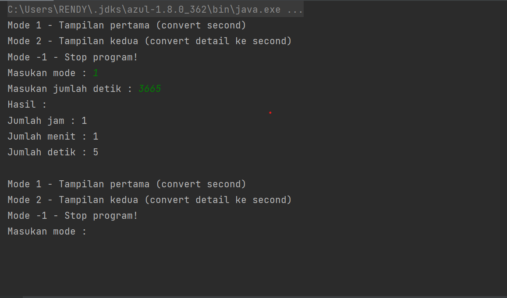

# takeHomeTestSinar

i am using java 8 and use maven as a build automation tools

on every package you can see the solution of every question.

Here you can see how to use the program, here we need to
input the correct mode, you can give the input as 1 or 2, and we
proceed the program based on your input.

After you give the correct mode, we expect you to give us the 
correct input on every mode, on this image you should give us 
an integer that represent time in seconds.

After the program give us the correct output, the program will
prompt you again to give correct mode. It will looping until you
force stop the program or you can input -1 for safety process.

Feel free to contact me if encountered any issue. Enjoy your day!

